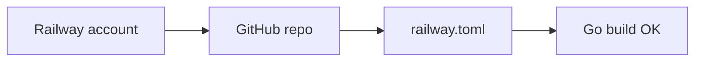
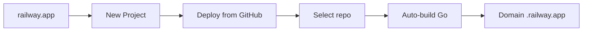
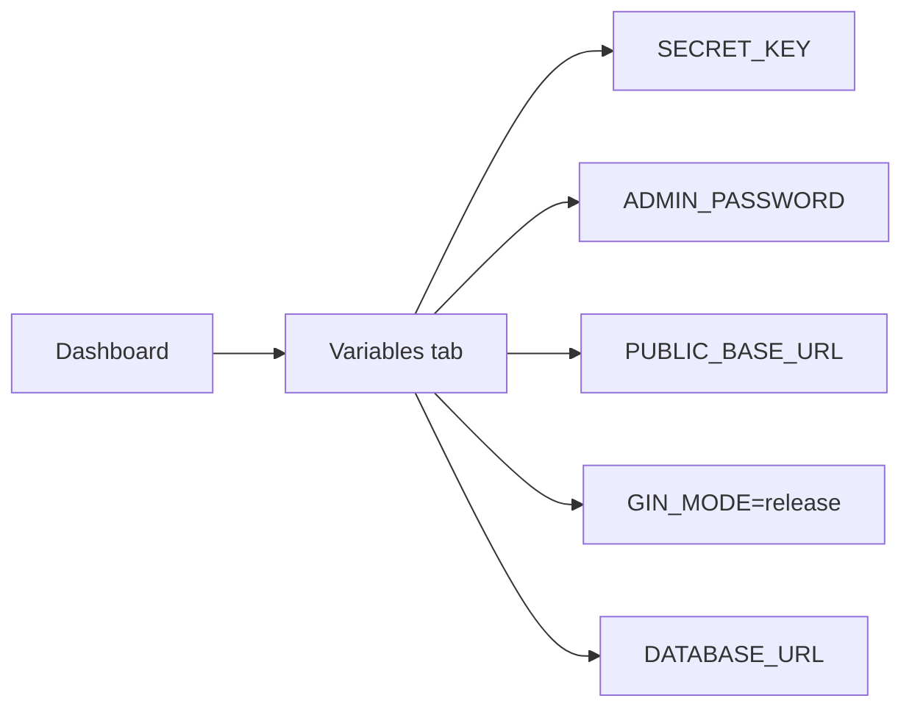

# Deploy GoShorty lên Railway

> **Thời gian dự kiến**: 15-20 phút
> **Chi phí**: $0 (Railway free tier: $5 credit/tháng, không cần credit card)
> **Lưu ý**: Static files (index.html) được embed vào Go binary — không cần quan tâm đường dẫn filesystem khi deploy.

---

## Timeline

### Phase 1: Chuẩn bị (5 phút)



**Bước 1.1** — Tạo tài khoản Railway
- Truy cập https://railway.app
- Đăng nhập bằng GitHub
- Free tier: $5 credit, không cần credit card

**Bước 1.2** — Push lên GitHub
```bash
# Nếu chưa có git repo:
git init
git add .
git commit -m "GoShorty ready for Railway"

# Tạo repo trên GitHub, rồi:
git remote add origin https://github.com/YOUR_USER/goshorty.git
git push -u origin main
```

**Bước 1.3** — File `railway.toml` đã được tạo sẵn trong project.

---

### Phase 2: Deploy (5 phút)



**Bước 2.1** — Tạo project trên Railway
1. Dashboard → **New Project**
2. Chọn **Deploy from GitHub repo**
3. Select repo `goshorty`
4. Railway tự động:
   - Phát hiện `go.mod` → build Go
   - Chạy `go build -o app`
   - Start với `./app`

**Bước 2.2** — Chờ build (~2-3 phút)
- Railway sẽ hiển thị log build real-time
- Nếu lỗi, kiểm tra log ở tab **Deployments**

---

### Phase 3: Cấu hình (5 phút)



**Bước 3.1** — Set environment variables

| Variable | Required | Value |
|----------|----------|-------|
| `SECRET_KEY` | ✅ **YES** | Generate: `openssl rand -hex 32` |
| `ADMIN_PASSWORD` | ✅ **YES** | Mật khẩu mạnh |
| `DATABASE_URL` | ✅ **YES** | Railway PostgreSQL service reference |
| `ADMIN_EMAIL` | No | `admin@yourdomain.com` |
| `PUBLIC_BASE_URL` | ✅ **YES** | Domain HTTPS do Railway cấp, ví dụ `https://goshorty.up.railway.app` |
| `TOKEN_TTL` | No | `24h` (mặc định) |
| `GIN_MODE` | No | `release` (để tắt debug) |

**Cách set**:
1. Vào project → **Variables** tab
2. Thêm từng biến

**Generate SECRET_KEY**:
```bash
# Windows PowerShell:
-join ((48..57)+(65..90)+(97..122) | Get-Random -Count 32 | % {[char]$_})

# Linux/Mac:
openssl rand -hex 32
```

---

### Phase 4: Kiểm tra (5 phút)

**Bước 4.1** — Verify deployment
- Railway cấp domain: `https://goshorty.up.railway.app`
- Mở trình duyệt → kiểm tra login
- Test: `GET https://goshorty.up.railway.app/health`

**Bước 4.2** — Set PUBLIC_BASE_URL
```bash
railway env set PUBLIC_BASE_URL=https://goshorty.up.railway.app
```

**Bước 4.3** — Redeploy (sau khi set PUBLIC_BASE_URL)
- Railway tự động redeploy khi env thay đổi

---

## Environment Variables Reference

| Variable | Mặc định | Production |
|----------|----------|------------|
| `SECRET_KEY` | **required** | `openssl rand -hex 64` |
| `ADMIN_PASSWORD` | `admin123` chỉ ở debug | **Bắt buộc** khi `GIN_MODE=release`, dùng 12+ ký tự |
| `DATABASE_URL` | in-memory ở debug | **Bắt buộc** khi `GIN_MODE=release`; lấy từ Railway PostgreSQL |
| `ADMIN_EMAIL` | `admin@goshorty.local` | Email thật |
| `PUBLIC_BASE_URL` | `http://localhost:8080` | **Bắt buộc**, ví dụ `https://goshorty.up.railway.app` |
| `BASE_URL` | — | Chỉ giữ để tương thích; `PUBLIC_BASE_URL` được ưu tiên |
| `PORT` | `8080` | Railway tự set |
| `TOKEN_TTL` | `24h` | Giữ nguyên |
| `GIN_MODE` | debug | `release` |

---

## Railway CLI (Optional)

Nếu muốn dùng CLI thay vì web dashboard:

```bash
# Install
npm install -g @railway/cli

# Login
railway login

# Init project (nếu chưa deploy từ web)
railway init

# Deploy
railway up

# Set env vars
railway env set SECRET_KEY="your-secret-key"
railway env set ADMIN_PASSWORD="your-admin-password"
railway env set PUBLIC_BASE_URL="https://goshorty.up.railway.app"
railway env set GIN_MODE=release

# Open in browser
railway open

# View logs
railway logs
```

Trước khi deploy release, thêm một PostgreSQL service trong cùng Railway project
và tham chiếu biến `DATABASE_URL` của service đó vào GoShorty. Ứng dụng tự chạy
các migration còn thiếu khi khởi động; không cần chạy SQL thủ công.

---

## Kiểm tra hoàn tất

Sau khi deploy, kiểm tra:

```bash
# Health check
curl https://goshorty.up.railway.app/health

# API info
curl https://goshorty.up.railway.app/api

# Login test
curl -X POST https://goshorty.up.railway.app/api/auth/login \
  -H "Content-Type: application/json" \
  -d '{"username":"admin","password":"your-admin-password"}'
```

---

## Troubleshooting

| Vấn đề | Nguyên nhân | Fix |
|---------|-------------|-----|
| SECRET_KEY not set | Env var missing | Set SECRET_KEY trong Variables |
| Build fail | Go version mismatch | railway.toml chỉ định builder |
| 404 not found | Static files missing | Kiểm tra đường dẫn ./static |
| Port binding fail | Railway PORT không match | portFromEnv handle rồi |
| CORS error | Browser chặn | CORS đang là * (OK cho public) |
